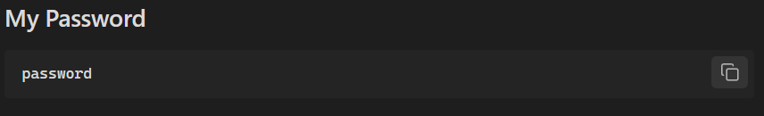
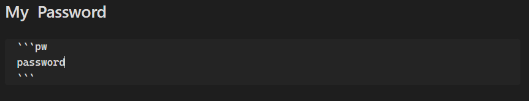
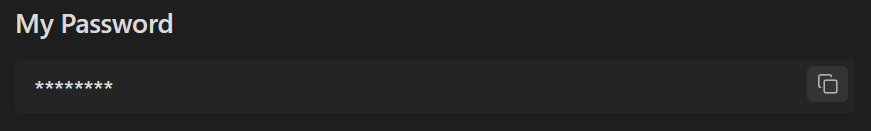

# Obsidian Password Codeblock Plugin

This is a password codeblock plugin for Obsidian (https://obsidian.md).

Obsidian Password Codeblock Plugin will mask your text codeblock as pw. 

### How to install
- Download main.js and manifest.json file from release
- Open obsidian > setting > Community plugins > Enable (if not enabled)
- Open plugins folder
- Create new directory "obsidian-password-codeblock-plugin" (or name of your choice)
- Put the downloaded main.js and manifest.json
- Reload Plugins in Community Plugins
- Enable Password Codeblock
- Restart or Press Ctrl+P (or Cmd+P on macOS) to open the Command palette > (Search) Reload app without saving
